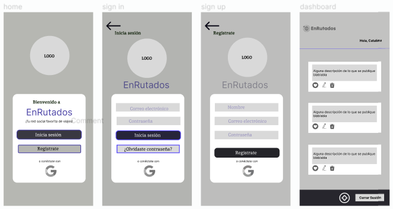
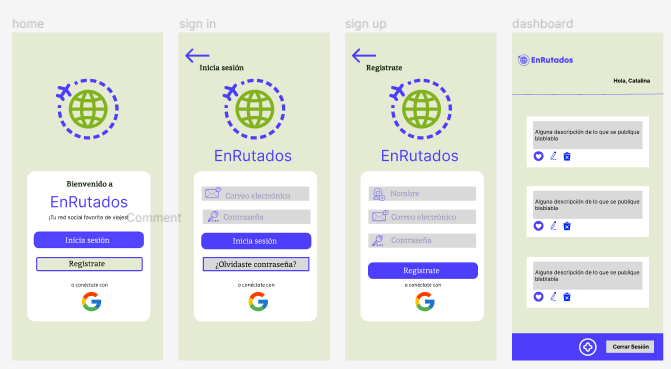

# Enrutados: Tu Red Social de Viajes Favorito

## 1. Descripción

EnRutados es una red social enfocada ha viajeros y que en ella puedan contar sus experiencias de viajes, dar recomendaciones sobre rutas, restaurant, alojamiento, etc.
Esperamos que sea una guía para ruteros que aún no han estado ahí y cuando viajen sea una experiencia agradable y segura.
Esta red social atrae a una comunidad diversa de viajeros que comparten una pasión común por explorar el mundo, aprender de las experiencias de los demás y utilizar esa sabiduría colectiva para enriquecer sus propias travesías.

## 2. Definición del producto

#### Principales Usuarios

Los usuarios de esta red social de viajeros se dividen en varias categorías, cada una reflejando un enfoque particular hacia la exploración y la planificación de viajes. Los "Exploradores Activos" son amantes de nuevas culturas que comparten experiencias detalladas, mientras que los "Planificadores Detallistas" utilizan la plataforma como una herramienta integral para obtener recomendaciones específicas y crear itinerarios detallados. Los "Conectores Sociales" encuentran en la red social una forma de establecer conexiones significativas con otros viajeros, construyendo una comunidad en línea. Los "Contadores de Historias" comparten no solo hechos, sino también emociones y lecciones, buscando inspirar. Por último, los "Aventureros Flexibles" valoran la flexibilidad, explorando destinos únicos y descubriendo consejos no convencionales en la plataforma. En conjunto, estos usuarios contribuyen a una comunidad diversa y activa de entusiastas de los viajes.

#### Solución de problema

La plataforma aborda de manera completa varios desafíos comunes enfrentados por los entusiastas de los viajes. En primer lugar, para aquellos que experimentan una "Falta de Inspiración", la plataforma proporciona una fuente constante de ideas al permitir a los usuarios explorar auténticas experiencias compartidas por otros viajeros. En términos de "Planificación Eficiente", facilita la organización de viajes al ofrecer información detallada sobre destinos, alojamientos, actividades y restaurantes, simplificando así la toma de decisiones informadas y ahorrando tiempo y esfuerzo. La plataforma también aborda la "Conexión Social", proporcionando a los usuarios un espacio para conectarse, compartir experiencias y recibir recomendaciones personalizadas, construyendo así una comunidad en línea.

Además, se ocupa de la "Autenticidad y Confianza" al permitir que los usuarios compartan experiencias reales, estableciendo una base de confianza basada en vivencias personales. Para aquellos que buscan el "Descubrimiento de Gemas Ocultas", la plataforma resalta destinos menos conocidos y ofrece recomendaciones únicas que no suelen encontrarse en guías turísticas convencionales. Finalmente, resuelve la "Falta de Contenido Enriquecedor" al permitir que los viajeros compartan no solo información práctica, sino también historias emotivas y lecciones aprendidas, agregando un componente narrativo significativo a la planificación del viaje. En conjunto, esta red social mejora sustancialmente la calidad y la experiencia general de viaje para sus usuarios.

## 3.Historia de Usuario

Se realizó una encuesta para dar enfoque a nuestra Historia de Usuario la cual arrojó:

#### HU1: Como viajero frecuente, quiero loguearme en red social con tematica para viajeros para compartir mis experiancias.

#### Criterios de aceptación:

- La aplicación debe permitir crear una publicación.
- El usuario debe poder editar su publicación.
- El usuario puede borrar su publicación.
- El usuario puede dar like a su publicación y ver el total de likes dados a su post.

#### Definición de terminado:

Para que una publicación se de por terminada debe cumplir con:

- Debe tener un botón de subir post.
- Al dar click al botón se abre el cuadro que permite escribir y guardar la publicación.
- Debe tener un botón que permita editar la publicación y que se guarden los cambios.
- Debe tener un botón para la borrar el post.
- Solo el usuario que crea la publicación puede editarla y borrarla.
- Se pueda dar, quitar like y llevar el conteo.

#### HU2: Como registrado en la red social Enrutados , quiero ingresar , alojamiento y para consultar información y publicar mis experiencias de viaje

#### Criterios de aceptación:

- La aplicación debe permitir ingresar con el usuario y contraseña
- Ingreso con Google
- Que ingrese datos correctos

#### Definición de terminado:

- Ingreso Exitoso con Usuario y Contraseña: Se ha implementado y verificado que la aplicación permita a los usuarios registrados ingresar correctamente utilizando su nombre de usuario y contraseña.
- Ingreso Exitoso con Google: Se ha desarrollado y comprobado la funcionalidad que permite a los usuarios ingresar a Enrutados utilizando sus credenciales de Google.
- Validación de Datos de Ingreso: Se ha incorporado y confirmado una verificación que garantiza que los datos ingresados sean correctos, proporcionando una capa adicional de seguridad y precisión en el proceso de inicio de sesión.

#### La Historia de Usuario se considerará "Terminada" únicamente si se han implementado satisfactoriamente las tres funcionalidades mencionadas, asegurando así que los usuarios tengan múltiples opciones para ingresar a Enrutados y que la validación de datos garantice un proceso de inicio de sesión seguro y eficiente.

## 4. Prototipos de Alta y Baja Fidelidad

### Prototipo de Baja

En este repositorio, encontrarás un prototipo de baja fidelidad del producto. Este prototipo es una representación inicial y simplificada de la interfaz de usuario, diseñada para explorar y validar conceptos de diseño antes de avanzar a etapas más detalladas.

### Prototipo de Alta

Este repositorio incluye un prototipo de alta fidelidad del producto. El prototipo representa una versión avanzada y visualmente detallada de la interfaz de usuario, proporcionando una representación más cercana al producto final.

- Haz click para ver la versión dinámica: [Prototipo de alta](https://www.figma.com/proto/VhcEIKNlaHKGoMutllISMz/Untitled?type=design&node-id=4-2&t=9e3NbVhaz3mPw70U-0&scaling=scale-down&page-id=0%3A1)

## 5. Consideraciones técnicas UX

#### HU1: Mejora de la Experiencia de Edición de Publicaciones

Como un usuario activo de la aplicación de red social para viajeros, deseo una experiencia más intuitiva y eficiente al editar mis publicaciones. Después de participar en el test de usabilidad, donde se identificaron dificultades en la interfaz de edición, quiero que la aplicación simplifique el proceso de edición de publicaciones. Esto incluye la posibilidad de realizar cambios directamente en el contenido de la publicación, así como la capacidad de agregar y editar etiquetas o ubicaciones de manera más accesible. Esto mejorará significativamente la usabilidad y eficiencia del proceso de edición.

#### HU2: Ajuste de la Funcionalidad de Filtros en las Publicaciones

Como usuario que busca una experiencia eficiente y efectiva al utilizar la aplicación de red social para viajeros, he notado a través de un test de usabilidad que algunos filtros en las publicaciones no responden correctamente o no contribuyen significativamente a la búsqueda de contenido relevante.
Les recomiendo que omitan los botones que no presentan ninguna función.
